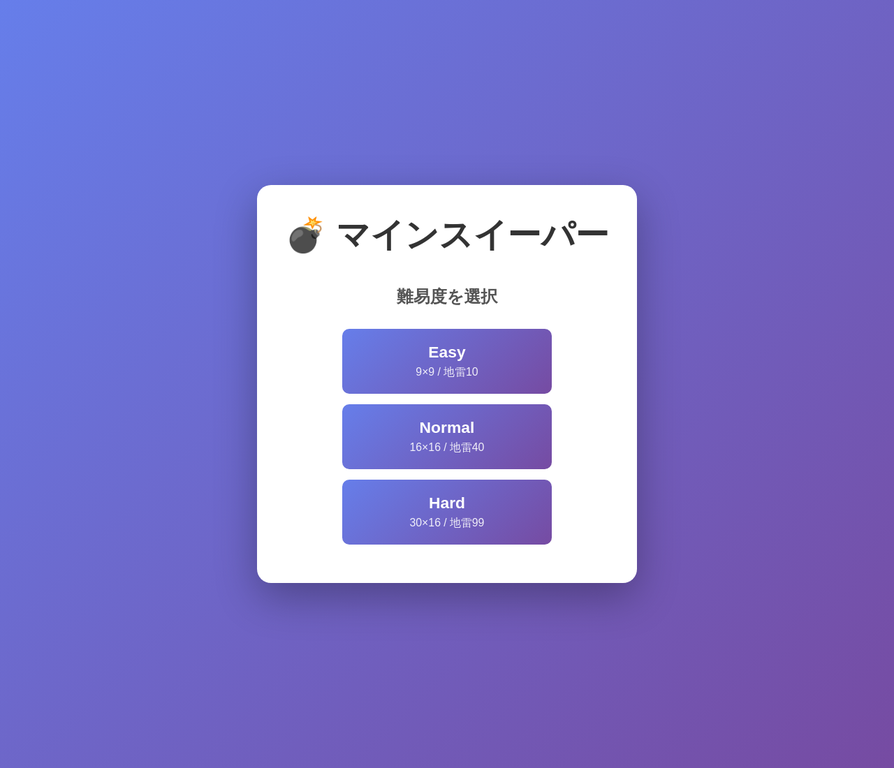
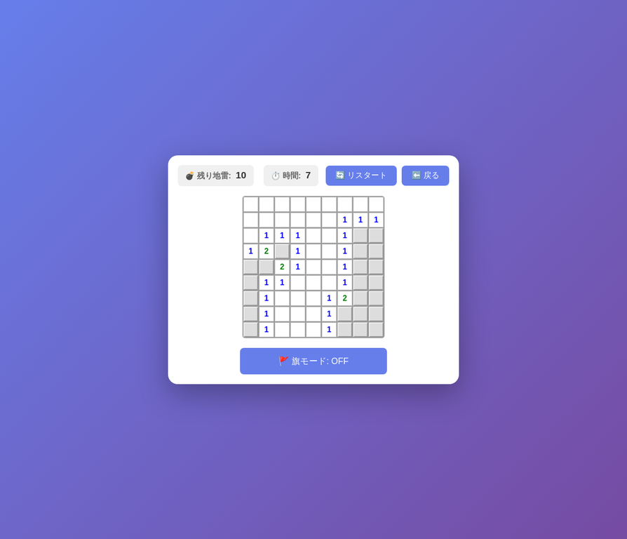

# 💣 マインスイーパー

ブラウザで遊べるクラシックなマインスイーパーゲームです。

## 🎮 ゲーム概要

地雷が隠されたマス目の中から、地雷以外のすべてのマスを開くことが目標です。
各マスには周囲8マスの地雷数が表示されます。地雷を踏むとゲームオーバーです。

## 🌐 公開URL

**GitHub Pages:** [こちらでプレイ](https://tailofyukki-cell.github.io/minesweeper-game/)

## ✨ 機能

- 3段階の難易度設定
- 初手セーフ保証(初手とその周囲は地雷なし)
- 連鎖オープン機能
- 旗(フラグ)機能
- タイマー機能
- レスポンシブデザイン(PC/スマホ対応)

## 🎯 難易度仕様

| 難易度 | サイズ | 地雷数 |
|--------|--------|--------|
| Easy   | 9×9    | 10     |
| Normal | 16×16  | 40     |
| Hard   | 30×16  | 99     |

## 🕹️ 操作方法

### PC
- **左クリック**: マスを開く
- **右クリック**: 旗を立てる/外す

### スマホ/タブレット
- **タップ**: マスを開く
- **長押し**: 旗を立てる/外す
- **旗モードボタン**: タップで開く/旗を切り替え

## 🚀 ローカル実行方法

1. リポジトリをクローン
```bash
git clone https://github.com/tailofyukki-cell/minesweeper-game.git
cd minesweeper-game
```

2. ブラウザで `index.html` を開く
```bash
# Macの場合
open index.html

# Linuxの場合
xdg-open index.html

# Windowsの場合
start index.html
```

または、簡易サーバーを起動:
```bash
# Python 3の場合
python3 -m http.server 8000

# Node.jsの場合
npx serve
```

ブラウザで `http://localhost:8000` にアクセス

## 🛠️ 技術スタック

- HTML5
- CSS3 (Flexbox, Grid, Gradient)
- Vanilla JavaScript (ES6+)

外部ライブラリは使用していません。

## 📝 ライセンス

MIT License

Copyright (c) 2026

Permission is hereby granted, free of charge, to any person obtaining a copy
of this software and associated documentation files (the "Software"), to deal
in the Software without restriction, including without limitation the rights
to use, copy, modify, merge, publish, distribute, sublicense, and/or sell
copies of the Software, and to permit persons to whom the Software is
furnished to do so, subject to the following conditions:

The above copyright notice and this permission notice shall be included in all
copies or substantial portions of the Software.

THE SOFTWARE IS PROVIDED "AS IS", WITHOUT WARRANTY OF ANY KIND, EXPRESS OR
IMPLIED, INCLUDING BUT NOT LIMITED TO THE WARRANTIES OF MERCHANTABILITY,
FITNESS FOR A PARTICULAR PURPOSE AND NONINFRINGEMENT. IN NO EVENT SHALL THE
AUTHORS OR COPYRIGHT HOLDERS BE LIABLE FOR ANY CLAIM, DAMAGES OR OTHER
LIABILITY, WHETHER IN AN ACTION OF CONTRACT, TORT OR OTHERWISE, ARISING FROM,
OUT OF OR IN CONNECTION WITH THE SOFTWARE OR THE USE OR OTHER DEALINGS IN THE
SOFTWARE.

## 🎨 スクリーンショット

### 開始画面


### ゲーム画面


## 🤝 貢献

バグ報告や機能提案は Issues からお願いします。

## 📧 連絡先

質問や提案がある場合は、Issues を通じてご連絡ください。
